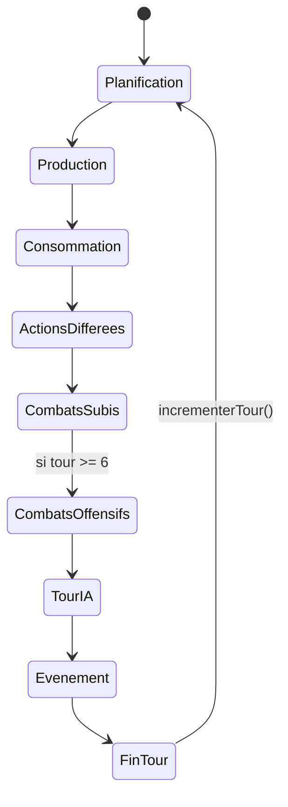
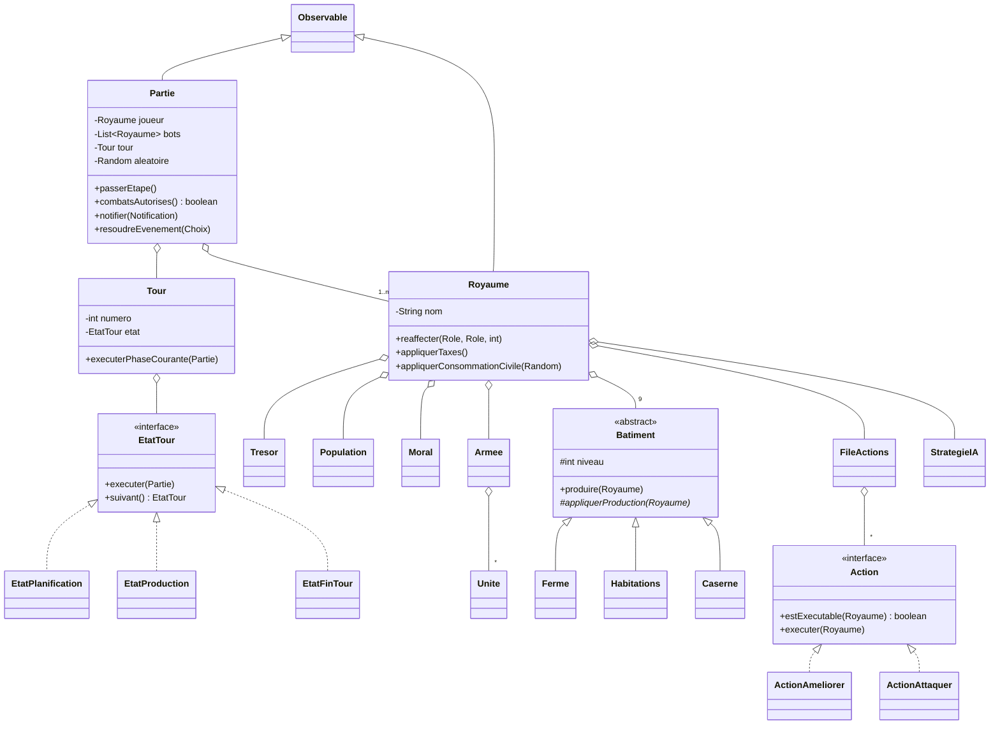
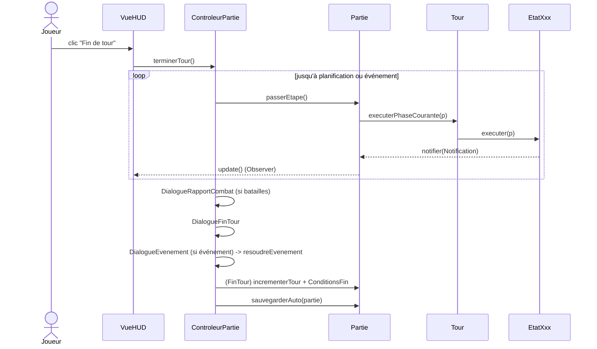

# BAS7ION — Documentation technique

> Document de référence rédigé par l'équipe BAS7ION. Il explique l'intégralité
> de notre architecture et du fonctionnement du jeu : package par package,
> classe par classe, avec nos choix de conception, des extraits de notre code,
> des exemples chiffrés détaillés et un scénario de tour commenté. Objectif :
> qu'un lecteur n'ayant jamais ouvert le code (coéquipier ou jury) comprenne
> exactement comment tout s'articule.

---

## Sommaire

1. [Présentation et règles du jeu](#1-présentation-et-règles-du-jeu)
2. [Organisation du dépôt et build](#2-organisation-du-dépôt-et-build)
3. [Notre architecture MVC](#3-notre-architecture-mvc)
4. [Les patrons de conception que nous avons employés](#4-les-patrons-de-conception)
5. [Le cycle de jeu : Partie, Tour et machine à états](#5-le-cycle-de-jeu)
6. [Le patron Observateur et nos notifications](#6-le-patron-observateur)
7. [L'économie en détail](#7-léconomie-en-détail)
8. [La population et le moral](#8-la-population-et-le-moral)
9. [Les bâtiments](#9-les-bâtiments)
10. [L'équilibrage centralisé](#10-léquilibrage-centralisé)
11. [Les actions (patron Commande)](#11-les-actions-patron-commande)
12. [Le militaire et le moteur de combat](#12-le-militaire-et-le-moteur-de-combat)
13. [L'intelligence artificielle](#13-lintelligence-artificielle)
14. [Les événements](#14-les-événements)
15. [La persistance JSON et l'intégrité](#15-la-persistance-json-et-lintégrité)
16. [La couche Vue (Swing et thème)](#16-la-couche-vue)
17. [Les contrôleurs](#17-les-contrôleurs)
18. [Les tests JUnit](#18-les-tests-junit)
19. [Scénario complet d'un tour, commenté](#19-scénario-complet-dun-tour-commenté)
20. [Glossaire](#20-glossaire)
21. [Notes pour la soutenance](#21-notes-pour-la-soutenance)

---

## 1. Présentation et règles du jeu

**BAS7ION** est une **simulation de royaume médiéval au tour par tour**, écrite
en **Java 21** avec une interface graphique **Swing**. Le joueur dirige un
royaume face à 1 à 4 royaumes adverses tenus par une intelligence artificielle.

À chaque tour, le joueur prend une série de décisions :

- **affecter sa population** à cinq métiers (fermier, mineur, bûcheron, érudit, soldat) ;
- **produire** cinq ressources (or, nourriture, bois, pierre, savoir) ;
- **améliorer** ses neuf bâtiments ;
- **recruter** une armée et choisir une **posture de combat** ;
- **attaquer** un voisin (possible seulement à partir du tour 6) ;
- **réagir** à des événements aléatoires ou scriptés ;
- **régler ses taxes**, arbitrage permanent entre l'or rentré et le moral du peuple.

**Conditions de fin** (classe `ConditionsFin`) :

- **Victoire** : accumuler **5 000 or** (victoire par prospérité) **ou** éliminer
  tous les bots (population adverse à zéro).
- **Défaite** : population du joueur à 0, moral ≤ 5, ou atteinte du **tour 50**
  sans avoir gagné.

Le jeu est intégralement en français côté métier (noms de classes et de
méthodes), tout en gardant les termes Java standard en anglais (`getX`,
`Listener`, `Observable`).

---

## 2. Organisation du dépôt et build

Nous n'utilisons **ni Maven ni Gradle** : la compilation se fait au `javac` nu,
pilotée par un script maison **`build.sh`**.

```bash
./build.sh          # compile src/ dans bin/ + copie les ressources (images)
./build.sh run      # compile puis lance le jeu (avec Gson au classpath)
./build.sh test     # compile et exécute toute la batterie JUnit
./build.sh clean    # vide bin/
```

Détails du script (importants à connaître) :

- Il se place d'abord dans **son propre dossier** (`cd "$(dirname "$0")"`) et
  n'utilise que des **chemins relatifs** : le dossier du projet contient un
  espace (`Programmation objet`), donc aucun argument transmis à `javac` ne doit
  contenir cet espace, sinon le build casse. C'est un choix volontaire de
  robustesse.
- La compilation utilise `javac` avec **Gson** (`lib/gson-2.13.2.jar`) au
  classpath ; l'encodage UTF-8 est forcé (accents). Gson est aussi requis **à
  l'exécution** du jeu (sauvegarde/chargement), d'où sa présence au classpath de
  `./build.sh run`.
- Le dossier **`lib/`** contient nos seules dépendances externes :
  `gson-2.13.2.jar`, `junit-4.13.2.jar`, `hamcrest-core-1.3.jar`.
- Les **images** (`.png`, `.jpg`) sont recopiées de `src/` vers `bin/` pour être
  trouvées à l'exécution.
- Pour les tests, le script ajoute les jars de `lib/` au classpath et lance le
  *runner* console de JUnit (voir §18).

Arborescence (résumé) :

```
projet/
├── build.sh
├── lib/                     junit-4.13.2.jar, hamcrest-core-1.3.jar
├── src/
│   ├── Main.java
│   ├── config/              Equilibrage, Difficulte
│   ├── Modele/              partie/(+etat/), royaume/, economie/, population/,
│   │                        infrastructure/, militaire/, combat/, action/, ia/,
│   │                        evenement/, notification/, persistance/
│   ├── Vue/                 (+menu/, onglets/, dialogue/, theme/)
│   └── Controleur/
└── tests/                   les suites JUnit
```

---

## 3. Notre architecture MVC

Nous avons appliqué une séparation **Modèle – Vue – Contrôleur** stricte, imposée
par le cours, avec une convention de nommage en majuscule initiale :
`Modele/`, `Vue/`, `Controleur/`.

- **Modèle** (`Modele/`, `config/`) : toute la logique métier. Il ne connaît
  **rien** de Swing.
- **Vue** (`Vue/`) : l'affichage Swing. Elle lit le modèle et l'observe, mais ne
  le modifie jamais.
- **Contrôleur** (`Controleur/`) : la colle. Il branche les écouteurs Swing
  (clics, saisies) sur les méthodes du modèle.

Nous avons tenu **trois règles d'or** tout au long du projet :

1. **Aucune vue n'écrit dans le modèle.** Les vues exposent leurs composants
   (boutons, champs) via des accesseurs ; ce sont les contrôleurs qui leur
   attachent des `ActionListener`. Cela garantit qu'on peut tester tout le métier
   sans lancer l'interface.
2. **Aucun modèle n'importe `javax.swing.*`.** On peut le vérifier d'un
   `grep` : aucune classe de `Modele/` ne dépend de Swing.
3. **Les écouteurs sont branchés par les contrôleurs**, jamais dans le
   constructeur d'une vue.

Le bénéfice concret : nos **66 tests JUnit** instancient directement `Royaume`,
`Partie`, `Batiment`… sans ouvrir une seule fenêtre.

---

## 4. Les patrons de conception

Nous avons identifié et utilisé huit patrons. Pour chacun, voici *pourquoi* nous
l'avons choisi (et pas seulement *où*).

| Patron | Où | Pourquoi ce choix |
|---|---|---|
| **MVC** | les 3 packages racines | testabilité, parallélisation du travail en équipe |
| **Observer** | `Partie`/`Royaume` `extends Observable` + `Notification` | l'IHM se met à jour seule quand le modèle change, sans couplage |
| **State** | `partie/etat/EtatTour` + 9 états | un tour = un enchaînement de phases ; chaque phase est une classe isolée et testable |
| **Command** | `action/Action` + 7 actions + `FileActions` | rendre les actions du joueur **différables** (file) et **annulables** (remboursement) |
| **Strategy** | `ia/StrategieIA` + `StrategieEquilibree` | pouvoir ajouter d'autres IA (agressive, défensive…) sans toucher au reste |
| **Factory** | `ia/FabriqueIA` | centraliser la création des stratégies |
| **Builder** | `partie/PartieBuilder` | construire une `Partie` avec des paramètres optionnels chaînés et lisibles |
| **Template Method** | `infrastructure/Batiment.produire()` | factoriser le cycle de chantier commun, laisser chaque bâtiment redéfinir `appliquerProduction()` |

---

## 5. Le cycle de jeu

### 5.1 `Partie` — la racine du modèle

`Partie` hérite de `java.util.Observable`. Elle agrège tout l'état d'une partie :

```java
public class Partie extends Observable {
    private final Royaume joueur;
    private final List<Royaume> bots;
    private final Tour tour;
    private final List<BatailleResolue> batraillesDuTour;
    private Evenement evenementEnAttente;
    private boolean grenouilleEmpoisonneeDeclenchee;
    private Random aleatoire = new Random();
    ...
}
```

Méthodes clés :

- `passerEtape()` — fait avancer le jeu **d'une seule phase** (délègue à `Tour`).
- `combatsAutorises()` — `return numeroTour() >= Equilibrage.TOUR_DEBUT_COMBATS;`
  (verrou des combats avant le tour 6).
- `notifier(Notification n)` — helper public qui fait `setChanged()` puis
  `notifyObservers(n)` (les sous-classes d'état ne peuvent pas appeler
  `setChanged()` directement car il est `protected`).
- `declencherEvenement(e)` / `resoudreEvenement(Choix c)` — gestion d'un
  événement modal.
- `aleatoire()` / `definirGraineAleatoire(long)` — **un seul** générateur
  pseudo-aléatoire pour toute la partie : combats, famine, événements. Il est
  **seedable**, ce qui rend nos parties (et nos tests) **reproductibles**.

### 5.2 `Tour` — compteur + machine à états

```java
public class Tour {
    private int numero;          // commence à 1
    private EtatTour etat;       // commence par EtatPlanification

    public void executerPhaseCourante(Partie partie) {
        EtatTour courant = this.etat;
        courant.executer(partie);
        this.etat = courant.suivant();   // transition
    }
    public boolean enAttenteJoueur() {
        return this.etat instanceof EtatPlanification;
    }
}
```

`definirNumero(int)` permet de **forcer** le numéro de tour (utilisé pour
restaurer une sauvegarde).

### 5.3 Les 9 phases (patron State)

Chaque phase implémente l'interface :

```java
public interface EtatTour {
    void executer(Partie partie);   // traitement de la phase
    EtatTour suivant();             // phase suivante (jamais null)
    String nomCle();                // identifiant texte, ex "phase.production"
}
```

La chaîne des `suivant()` définit l'ordre exact d'un tour :

```
        ┌────────────────────────────────────────────────────────────────┐
        ▼                                                                  │
1. EtatPlanification    le joueur planifie — aucun traitement              │
2. EtatProduction       chaque bâtiment produit + collecte des taxes       │
3. EtatConsommation     chaque habitant mange 1 nourriture ; famine sinon  │
4. EtatActionsDifferees exécute la FileActions du joueur (améliorations…)  │
5. EtatCombatsSubis     les bots attaquent le joueur        (si tour ≥ 6)  │
6. EtatCombatsOffensifs les attaques du joueur se résolvent (si tour ≥ 6)  │
7. EtatTourIA           chaque bot joue (IA) et exécute ses actions        │
8. EtatEvenement        tirage d'un événement (ou grenouille au tour 6)    │
9. EtatFinTour          incrémente le tour, évalue les conditions de fin ──┘
```

Détail du contenu de `executer()` pour les phases qui font un vrai traitement :

- **EtatProduction** : pour chaque royaume, boucle `batiment.produire(r)` sur les
  9 bâtiments, puis `r.appliquerTaxes()`, puis notifications `TRESOR_CHANGE` /
  `BATIMENTS_CHANGES`.
- **EtatConsommation** : pour chaque royaume, `r.appliquerConsommationCivile(alea)`.
- **EtatActionsDifferees** : pour chaque royaume, `r.fileActions().executerToutes(r)`.
- **EtatCombatsSubis / EtatCombatsOffensifs** : gardés par `combatsAutorises()` ;
  résolvent les `Bataille` en attente via `EffetsCombat.appliquer(...)`.
- **EtatTourIA** : pour chaque bot, `bot.strategieIA().jouerTour(bot, partie)`.
- **EtatEvenement** : déclenche la grenouille au tour 6, sinon tire un événement
  aléatoire avec 15 % de chance.
- **EtatFinTour** : `partie.incrementerTour()` puis `ConditionsFin.evaluer(partie)`.

> **Notre choix** : isoler chaque phase dans sa propre classe rend le cycle
> lisible et testable phase par phase, et nous a permis d'ajouter facilement le
> **verrou de combat au tour 6** sans toucher aux autres phases.

### 5.4 Qui pilote la machine ?

Le joueur ne voit pas défiler ces neuf phases : c'est le **`ControleurPartie`**
qui, au clic sur « Fin de tour », appelle `passerEtape()` en boucle jusqu'à
revenir en planification, en s'arrêtant pour afficher un dialogue modal si un
événement survient (voir §17 et le scénario commenté §19).

### 5.5 `BilanTour` — la photo de début de tour

`BilanTour` capture les valeurs clés du royaume **au début** du tour
(ressources, population, armée, moral, niveaux de bâtiments). On la compare à
l'état de fin de tour pour afficher les **variations** dans le récapitulatif. Le
*timing* est crucial : nous prenons ce *snapshot* **avant** toute planification,
sinon le coût des améliorations (déduit dès la planification) n'apparaîtrait pas
dans le bilan.

---

## 6. Le patron Observateur

`Partie` et chaque `Royaume` héritent de `Observable`. Quand l'état change, le
modèle envoie une **`Notification`** :

```java
public class Notification {
    private final TypeNotification type;
    private final Object donnee;   // payload optionnel
}
```

Les vues implémentent `Observer.update(Observable, Object)`, filtrent sur le
`TypeNotification`, et appellent leur méthode privée `rafraichir()`.

Les 12 types (`TypeNotification`) :

```
Cycle de tour    : TOUR_DEMARRE, PHASE_CHANGEE, TOUR_TERMINE
État d'un royaume: TRESOR_CHANGE, POPULATION_CHANGEE, MORAL_CHANGE,
                   BATIMENTS_CHANGES, FILE_ACTIONS_CHANGEE
Événements       : EVENEMENT_EN_ATTENTE, EVENEMENT_RESOLU
Fin de partie    : PARTIE_GAGNEE, PARTIE_PERDUE
```

> **Notre choix** : un **seul** `Observable` par agrégat métier (`Partie`,
> `Royaume`). Les sous-composants comme `Tresor` ou `Population` ne notifient pas
> eux-mêmes — c'est le `Royaume` qui notifie pour eux. Sans cette règle, on aurait
> eu une cascade de notifications imbriquées impossible à suivre.

---

## 7. L'économie en détail

### 7.1 Ressources, Stock, Trésor

Les cinq ressources : `OR`, `NOURRITURE`, `BOIS`, `PIERRE`, `SAVOIR`.

Un **`Stock`** est une quantité bornée à `[0, capaciteMax]`. Extrait réel :

```java
public int ajouter(int montant) {
    int avant = this.quantite;
    this.quantite = Math.min(this.capaciteMax, this.quantite + montant);
    return this.quantite - avant;   // renvoie ce qui a réellement été ajouté
}
public int retirer(int montant) {
    int avant = this.quantite;
    this.quantite = Math.max(0, this.quantite - montant);
    return avant - this.quantite;   // renvoie ce qui a réellement été retiré
}
```

Le fait de **renvoyer la quantité réellement appliquée** est utilisé partout :
par exemple, la consommation détecte une famine en comparant le besoin et ce qui
a pu être retiré.

Le **`Tresor`** regroupe les 5 `Stock`. Valeurs de départ et capacités :

| Ressource | Stock initial | Capacité max |
|---|---|---|
| OR | 500 | 5000 |
| NOURRITURE | 100 | 1000 |
| BOIS | 200 | 1000 |
| PIERRE | 200 | 1000 |
| SAVOIR | 0 | 1000 |

### 7.2 Production (phase 2)

Chaque bâtiment producteur transforme le travail des habitants affectés en
ressources, avec un bonus de niveau.

| Bâtiment | Métier | Base / habitant | Bonus / niveau |
|---|---|---|---|
| Ferme | Fermier | 3 nourriture | +25 % |
| Mine | Mineur | 2 pierre + 1 or | +25 % |
| Scierie | Bûcheron | 3 bois | +25 % |
| Bibliothèque | Érudit | 2 savoir | +25 % |

Formule générale :

```
production = round( base × nbHabitants × (1 + 0,25 × (niveau − 1)) )
```

**Exemple travaillé.** Une Ferme de **niveau 3** avec **4 fermiers** :
`base = 4 × 3 = 12` ; `multiplicateur = 1 + 0,25 × (3−1) = 1,5` ;
`production = round(12 × 1,5) = 18` nourriture. Au niveau 5, le multiplicateur
atteint `1 + 0,25 × 4 = 2,0` : la production est **doublée**. Si le bâtiment est
endommagé, on multiplie en plus par 0,5.

### 7.3 Taxes (phase 2)

`NiveauTaxes` est une énumération à trois paliers :

| Palier | Or / habitant / tour | Moral / tour |
|---|---|---|
| FAIBLE | 1 | +2 |
| NORMAL | 2 | 0 |
| ELEVE | 3 | −3 |

`appliquerTaxes()` ajoute `nbHabitants × orParHabitant` au trésor et applique
l'impact moral. **Exemple** : 10 habitants, taxes ELEVE → +30 or et −3 moral par
tour.

### 7.4 Consommation et famine (phase 3)

Voici notre code réel (`Royaume.appliquerConsommationCivile`) :

```java
int total = this.population.total();
int besoin = total * Equilibrage.CONSOMMATION_NOURRITURE_PAR_HABITANT; // 1/habitant
int retire = this.tresor.retirer(Ressource.NOURRITURE, besoin);
int deficit = besoin - retire;
if (deficit > 0) {
    int morts = Math.max(1, deficit / 5);                 // 1 mort / 5 manquants
    int retireReellement = this.population.retirerHabitants(morts, aleatoire);
    this.moral.ajuster(Equilibrage.IMPACT_MORAL_PAR_FAMINE * retireReellement); // −2/mort
}
```

**Exemple travaillé.** 12 habitants, 0 nourriture : `besoin = 12`, `retire = 0`,
`deficit = 12` → `morts = max(1, 12/5) = 2`. Deux habitants meurent (tirés au
hasard parmi tous les rôles), le moral chute de `2 × 2 = 4` points.

---

## 8. La population et le moral

### 8.1 `Population`

Répartition d'habitants par **`Role`** : `INACTIF`, `FERMIER`, `MINEUR`,
`BUCHERON`, `ERUDIT`, `SOLDAT`. Au départ : 10 inactifs, capacité de logement 20.

Méthodes :

- `reaffecter(source, cible, n)` — déplace `n` habitants d'un rôle à un autre
  (échoue si pas assez d'habitants dans le rôle source).
- `ajouterInactifs(n)` — ajoute des inactifs, **plafonné par la capacité de
  logement**.
- `retirerHabitants(n, alea)` — retire `n` habitants tirés **au hasard** parmi
  tous les rôles (famine, pertes civiles de combat).
- `retirerInactifs(n)` — retire spécifiquement des inactifs (recrutement).
- `definirEffectif(role, n)` — fixe une valeur (utilisé à la restauration).

> **Décision d'équipe** : la population **n'augmente pas automatiquement**. Elle
> croît uniquement par **recrutement manuel** d'un villageois (bouton de l'onglet
> Économie), au coût de **30 nourriture**, dans la limite du logement disponible.
> Nous avions prototypé une croissance naturelle, puis nous l'avons retirée pour
> garder une progression entièrement maîtrisée par le joueur.

### 8.2 `Moral`

Valeur entière bornée à `[0, 100]`, initialisée à 50.

```java
public int ajuster(int delta) {
    int avant = this.valeur;
    this.valeur = clamp(this.valeur + delta);   // borné à [MORAL_MIN, MORAL_MAX]
    return this.valeur - avant;                 // variation réellement appliquée
}
```

Le moral monte avec des taxes faibles et de bons événements ; il descend avec la
famine, les taxes élevées et les défaites militaires.

---

## 9. Les bâtiments

Nos neuf bâtiments existent **dès le tour 1 au niveau 1**. La classe abstraite
`Batiment` applique le patron **Template Method** : la méthode `produire()` est
**finale** et gère le chantier ; chaque sous-classe redéfinit
`appliquerProduction()`.

### 9.1 Le cœur du patron : `produire()`

```java
public final void produire(Royaume royaume) {
    if (enChantier()) {
        this.toursRestants--;
        if (this.toursRestants == 0) {
            this.niveau++;
            // On applique aussitôt l'effet du nouveau niveau :
            appliquerProduction(royaume);
        }
        return;
    }
    appliquerProduction(royaume);
}
```

> **Bug que nous avons corrigé** : avant, à la fin d'un chantier, le niveau
> montait mais l'effet n'était appliqué qu'au tour *suivant*. Résultat :
> « agrandir la maison ne donnait aucune place de logement » pendant un tour.
> Désormais l'effet du nouveau niveau est appliqué **dès le tour de fin**.

### 9.2 Tableau des bâtiments

| Bâtiment | Effet | Détail |
|---|---|---|
| Ferme | nourriture | proportionnel aux fermiers |
| Mine | pierre + or | proportionnel aux mineurs |
| Scierie | bois | proportionnel aux bûcherons |
| Bibliothèque | savoir | proportionnel aux érudits |
| **Habitations** | capacité de logement | `20 + 20 × (niveau − 1)` |
| Caserne | débloque les unités | niveau requis croissant par type |
| Remparts | défense au combat | `+10 % × niveau` |
| Tour de Guet | détection | portée = niveau |
| Marché | échange de ressources | taux décroissant avec le niveau |

### 9.3 Améliorations

- Niveau maximum : **5**. Durée d'un chantier : **2 tours**.
- Le coût croît linéairement : `base × niveauCible`. Exemple pour la Ferme :
  vers le niveau 2 → 200 or + 100 bois ; vers le niveau 5 → 500 or + 250 bois.
- Le coût est **déduit dès la planification** par le contrôleur, et **remboursé**
  si le joueur annule avant la fin du tour.

### 9.4 Le Marché

```java
public double tauxEchange() {
    // Niv 1 : 3.0 | Niv 2 : 2.5 | … | Niv 5 : 1.0
    return Math.max(1.0, 3.0 - (this.niveau - 1) * 0.5);
}
public int quantiteRecue(int montantSource) {
    return (int) Math.floor(montantSource / tauxEchange());
}
```

**Exemple** : au niveau 1 (taux 3), donner 30 or rend `floor(30/3) = 10` unités ;
au niveau 5 (taux 1), 30 or rendent 30 unités.

---

## 10. L'équilibrage centralisé

Tous les nombres du jeu sont rassemblés dans **`config/Equilibrage.java`** (règle
d'or : **zéro nombre magique** dans le code métier). Cela nous a permis
d'ajuster tout l'équilibre depuis un seul fichier.

| Constante | Valeur | Rôle |
|---|---|---|
| `POPULATION_INITIALE` / `CAPACITE_LOGEMENT_INITIALE` | 10 / 20 | départ |
| `PRODUCTION_NOURRITURE_PAR_FERMIER` | 3 | rendement Ferme |
| `PRODUCTION_PIERRE_PAR_MINEUR` / `PRODUCTION_OR_PAR_MINEUR` | 2 / 1 | rendement Mine |
| `PRODUCTION_BOIS_PAR_BUCHERON` | 3 | rendement Scierie |
| `PRODUCTION_SAVOIR_PAR_ERUDIT` | 2 | rendement Bibliothèque |
| `CONSOMMATION_NOURRITURE_PAR_HABITANT` | 1 | consommation |
| `BONUS_*_PAR_NIVEAU` | 0.25 | +25 %/niveau de bâtiment |
| `CAPACITE_LOGEMENT_PAR_NIVEAU_HABITATIONS` | 20 | logement/niveau |
| `NIVEAU_MAX_BATIMENT` / `DUREE_CHANTIER_AMELIORATION` | 5 / 2 | améliorations |
| `MORAL_INITIAL` / `MORAL_MIN` / `MORAL_MAX` | 50 / 0 / 100 | moral |
| `IMPACT_MORAL_PAR_FAMINE` | −2 | par mort de faim |
| `COUT_NOURRITURE_PAR_VILLAGEOIS` | 30 | recruter un habitant |
| `COUT_OR_PAR_SOLDAT` / `HABITANTS_PAR_SOLDAT` | 30 / 1 | recruter un soldat |
| `PROBABILITE_EVENEMENT_PAR_TOUR` | 0.15 | événement aléatoire |
| `TOUR_GRENOUILLE_EMPOISONNEE` / `TOUR_DEBUT_COMBATS` | 6 / 6 | ouverture des combats |
| `PERTES_CIVILES_DEFAITE_PCT` | 20 | % civils tués si défaite |
| `BUTIN_VICTOIRE_PCT` | 25 | % ressources volées si victoire |
| `IMPACT_MORAL_DEFAITE_DEFENSIVE` | 8 | moral perdu si défaite |
| `OR_VICTOIRE_PROSPERITE` / `TOUR_MAX` | 5000 / 50 | conditions de fin |
| `SEUIL_OR_RECRUTEMENT_IA` | 200 | l'IA recrute au-dessus |
| `EFFECTIF_MIN_POUR_ATTAQUE_IA` | 5 | l'IA n'attaque pas sous ce seuil |
| `PROBA_ATTAQUE_IA_BASE` | 0.25 | probabilité de base d'attaque IA |

Le coût d'amélioration est calculé par la méthode `coutAmelioration(type,
niveauCible)` (un `switch` par type qui renvoie une `Map<Ressource, Integer>`).

`Difficulte` ajuste l'or initial du joueur : **FACILE +500**, **NORMAL 0**,
**DIFFICILE −200**.

---

## 11. Les actions (patron Commande)

L'interface :

```java
public interface Action {
    boolean estExecutable(Royaume royaume);  // préconditions
    void executer(Royaume royaume);          // effet
    String description();                    // clé texte (logs/IHM)
}
```

`FileActions` est une file FIFO. Son `executerToutes(royaume)` parcourt les
actions, exécute celles qui sont exécutables, compte, puis **vide la file**. Elle
est utilisée en **phase 4** pour les actions différées du joueur, et appelée
immédiatement par chaque bot à la fin de son tour.

| Action | Effet | Préconditions clés |
|---|---|---|
| `ActionAmeliorer` | démarre un chantier | bâtiment non max et pas déjà en chantier |
| `ActionMobiliser` | équipe des recrues en unités, paie l'or | or + recrues `SOLDAT` + niveau de caserne |
| `ActionDemobiliser` | renvoie des unités dans la population | unités du type disponibles |
| `ActionAttaquer` | planifie une `Bataille` | armée non vide, cible vivante ≠ soi, pas déjà attaquée |
| `ActionEchanger` | convertit une ressource via le Marché | montant disponible, gain ≥ 1 unité |
| `ActionRecruterVillageois` | +1 inactif contre 30 nourriture | nourriture suffisante + logement libre |

Extrait (`ActionMobiliser.estExecutable`) montrant nos trois préconditions :

```java
if (!royaume.tresor().contient(Ressource.OR, coutOr)) return false;
if (royaume.population().effectif(Role.SOLDAT) < recruesNecessaires) return false;
Batiment caserne = royaume.batiment(TypeBatiment.CASERNE);
return caserne != null && caserne.niveau() >= this.type.niveauCaserneRequis();
```

> **Deux temporalités.** Certaines actions sont **immédiates** (recruter un
> soldat, échanger, recruter un villageois → retour visuel instantané), d'autres
> sont **différées** (améliorations, attaques) et résolues en phase 4. C'est le
> patron Command qui rend ce double comportement possible proprement.

---

## 12. Le militaire et le moteur de combat

### 12.1 Les unités (`TypeUnite`)

| Type | Attaque | Défense | Caserne requise |
|---|---|---|---|
| Infanterie légère | 10 | 8 | niveau 1 |
| Archer | 12 | 6 | niveau 2 |
| Lancier | 8 | 12 | niveau 3 |
| Cavalerie lourde | 15 | 10 | niveau 4 |

Une `Unite` = un type + un effectif ; une `Armee` = une liste d'unités + une
posture. `Armee.recruter(type, n)` **fusionne** avec une unité existante du même
type (pas de doublons).

### 12.2 Pierre-Feuille-Ciseaux (`TableAvantages`)

Le cycle d'avantage (bonus **×1,5** = +50 % à l'attaque) :

```
Cavalerie lourde → Archer → Infanterie légère → Lancier → (Cavalerie lourde)
```

Notre implémentation est un simple `switch` de quatre cas (sinon 1,0). Le bonus
est ensuite **pondéré par la composition adverse** : une unité face à une armée
moitié archers / moitié lanciers obtient la moyenne pondérée des deux bonus.

### 12.3 Les postures (`PostureCombat`)

| Posture | × Attaque | × Défense | Remparts ? |
|---|---|---|---|
| ATTAQUE | 1,2 | 0,9 | oui |
| DEFENSE | 0,9 | 1,3 | oui |
| CONTOURNEMENT | 1,0 | 1,0 | **non** |

### 12.4 La résolution (`ResolveurCombat.resoudre`)

C'est une **méthode statique pure**, sans état, **déterministe** pour une graine
donnée (d'où la reproductibilité de nos tests). Extrait du cœur :

```java
double puissanceA = calculerPuissanceOffensive(attaquant, defenseur);
double puissanceD = calculerPuissanceDefensive(defenseur, attaquant);

puissanceA *= postureAttaquant.multAttaque();
puissanceD *= postureAttaquant.multDefense();

if (postureAttaquant.utiliseRemparts() && bonusRempartsPct > 0) {
    puissanceD *= 1.0 + bonusRempartsPct / 100.0;
}

Random r = new Random(seed);
puissanceA *= 1.0 + (r.nextDouble() * 2 - 1) * AMPLITUDE_ALEA; // ±10 %
puissanceD *= 1.0 + (r.nextDouble() * 2 - 1) * AMPLITUDE_ALEA;

if (puissanceA > puissanceD * MARGE_VICTOIRE)      v = ATTAQUANT;   // marge 1.1
else if (puissanceD > puissanceA * MARGE_VICTOIRE) v = DEFENSEUR;
else                                               v = EGALITE;
```

où la puissance offensive se calcule ainsi :

```java
for (Unite uA : attaquant.unites()) {
    double bonus = bonusMoyenContre(uA, defenseur, totalDef); // PFC pondéré
    puissance += uA.effectif() * uA.type().attaqueBase() * bonus;
}
```

Les **pertes** dépendent du vainqueur (en % de l'effectif engagé) :

| Issue | Pertes vainqueur | Pertes perdant |
|---|---|---|
| victoire/défaite | 20 % | 50 % |
| égalité | 30 % | 30 % |

Le résultat est un objet immuable **`RapportCombat`** (vainqueur, pertes des deux
camps, puissances calculées).

**Exemple travaillé.** 100 cavaliers lourds (attaque 15) attaquent 10 fantassins
(défense 8), posture ATTAQUE, sans remparts :

- PFC : cavalerie vs infanterie = 1,0 (la cavalerie ne bat que l'archer).
- Offensive ≈ `100 × 15 × 1,0 = 1500`, × 1,2 (posture) = 1800 (±10 %).
- Défensive ≈ `10 × 8 × 1,0 = 80`, × 0,9 (posture) = 72 (±10 %).
- 1800 ≫ 72 × 1,1 → **l'attaquant gagne**. Pertes attaquant = `round(100×0,2)=20`,
  défenseur = `round(10×0,5)=5`, puis (défenseur vaincu) armée anéantie, civils
  et butin appliqués (ci-dessous).

### 12.5 Les conséquences (`EffetsCombat.appliquer`)

`EffetsCombat` orchestre tout : il récupère le bonus de remparts du défenseur,
tire une graine via `partie.aleatoire().nextLong()`, mémorise les effectifs
avant combat, appelle le résolveur, applique les pertes militaires, et **si le
défenseur perd** :

- son armée est **anéantie** ;
- **20 %** de sa population civile périt (`PERTES_CIVILES_DEFAITE_PCT`) ;
- l'attaquant **pille 25 %** de chaque ressource (`BUTIN_VICTOIRE_PCT`) ;
- le défenseur perd **8** points de moral (`IMPACT_MORAL_DEFAITE_DEFENSIVE`).

Tout est consigné dans une **`BatailleResolue`** (effectifs avant/après, pertes
civiles, butin par ressource) qui alimente le `DialogueRapportCombat`.

> Nous avons **adouci** ces conséquences lors de l'équilibrage (avant : 40 %
> civils, 40 % butin, −12 moral) : une défaite faisait s'effondrer le royaume et
> rendait la partie injouable. Désormais on peut encaisser un raid et se
> reconstruire.

---

## 13. L'intelligence artificielle

- `StrategieIA` (interface, **Strategy**) : `void jouerTour(Royaume bot, Partie partie)`.
- `FabriqueIA` (**Factory**) : `creerEquilibree()` renvoie une `StrategieEquilibree`.
  L'interface est prête pour des variantes (agressive, défensive, commerçante).
- `StrategieEquilibree` est **déterministe** (les seules sources d'aléa sont les
  ressources et l'état du jeu) — donc nos parties contre l'IA sont reproductibles.

Ordre des décisions dans `jouerTour()` :

1. **Recruter des soldats** si `or ≥ 200` et armée < moitié de la population
   civile (entre 3 et 8 recrues). *Important : recruter **avant** d'équilibrer la
   population, sinon tous les inactifs seraient déjà affectés à des métiers et le
   bot n'aurait jamais d'armée.*
2. **Équilibrer la population** : cible ≈ 50 % fermiers, 20 % mineurs, 20 %
   bûcherons, 10 % érudits, le reste en inactifs.
3. **Améliorer un bâtiment** : trois tirages, il améliore le premier bâtiment
   améliorable qu'il peut payer (un seul par tour pour éviter une escalade).
4. **Décider d'attaquer** : seulement si `combatsAutorises()` (tour ≥ 6) et
   effectif ≥ 5 ; probabilité `0,25 + min(0,40 ; effectif/100)` (plus l'armée est
   grosse, plus le bot est agressif).
5. **Exécuter immédiatement** sa file d'actions (les bots n'ont pas de phase
   différée séparée).

---

## 14. Les événements

À la phase 8 :

- **Grenouille empoisonnée** — événement **scripté**, déclenché **d'office au tour
  6**, **une seule fois** par partie (drapeau `grenouilleEmpoisonneeDeclenchee`
  dans `Partie`). Il « annonce le début des combats » (son texte le souligne) et
  coïncide avec `TOUR_DEBUT_COMBATS`. Trois choix volontairement **peu violents**.
- Sinon, avec **15 %** de chance par tour (à partir du tour 2), un **événement
  aléatoire** est tiré du `CatalogueEvenements` par **tirage pondéré**.

Structure des événements :

```java
public abstract class Evenement {
    private final String titre, description;
    private final List<Choix> choix;     // une option = un Choix
}
public class Choix {
    private final String libelle;
    private final EffetEvenement effet;  // le plus souvent un EffetSimple
    public boolean peutEtreChoisi(Royaume r) { return effet.peutEtreApplique(r); }
}
```

`EffetSimple(deltaOr, habitantsPerdus, deltaMoral)` couvre la majorité des cas.
Le `DialogueEvenement` **désactive** les choix que le royaume ne peut pas
s'offrir (ex. un coût en or supérieur au trésor).

Le tirage pondéré (`TirageEvenement`) :

```java
int tirage = aleatoire.nextInt(CatalogueEvenements.POIDS_TOTAL);
int cumul = 0;
for (Entree e : CatalogueEvenements.ENTREES) {
    cumul += e.poids;
    if (tirage < cumul) return e.fabrique.get();
}
```

Le catalogue actuel (poids) : Épidémie 2, Sécheresse 2, Filon d'or 1, Réfugiés 2,
Bonne récolte 2, Attaque de brigands 1 — total 10. Chaque entrée est un
`Supplier<Evenement>` (fabrique paresseuse) pour ne pas partager une instance
entre deux tirages.

---

## 15. La persistance JSON et l'intégrité

Nous sauvegardons **au format JSON via la bibliothèque Gson** (sérialisation
automatique par réflexion — `gson.toJson` / `gson.fromJson`). Le jar est embarqué
dans `lib/`, comme JUnit, car notre build `javac` nu n'a pas de gestionnaire de
dépendances. La **sauvegarde est automatique à chaque fin de tour**, dans
`saves/<nom du royaume>.json` ; le chargement passe par le bouton « Charger une
sauvegarde » du menu (un `JFileChooser`).

> **Pourquoi Gson plutôt qu'un parseur maison ?** Java **n'a pas** de JSON dans
> sa bibliothèque standard (contrairement à Python ou JavaScript). Le JDK ne
> fournit que la sérialisation **binaire** (`ObjectOutputStream`) ou **XML**.
> Pour du JSON lisible *et* automatique, il faut une lib : nous avons choisi
> Gson, qui mappe nos objets ↔ JSON tout seul par réflexion. (Nous avions
> d'abord écrit un parseur à la main pour rester sans dépendance, puis nous
> sommes passés à Gson une fois la lib embarquée dans `lib/`.)

### 15.1 Les classes (`Modele/persistance/`)

- `EtatRoyaume` — POJO photographiant **un** royaume : ressources, population par
  rôle, niveaux et chantiers des bâtiments, **armée + posture**, moral, taxes.
  Gson le (dé)sérialise automatiquement (les `Map` à clé enum sont écrites avec
  le nom de l'enum comme clé, ex. `{"OR": 500}`). Il expose la capture
  `EtatRoyaume(Royaume)` et la restauration `appliquerA(Royaume)`.
- `Sauvegarde` — état complet de la partie = **joueur + tous les bots** + numéro
  de tour + graine aléatoire + drapeau grenouille. `versJson()` / `depuisJson()`
  s'appuient sur Gson + l'enveloppe ci-dessous.
- `Integrite` — calcule l'empreinte **SHA-256** d'une chaîne JSON.
- `GestionnaireSauvegardes` — lecture/écriture fichier, autosave, slots.
- La reconstruction passe par `PartieBuilder.depuisSauvegarde(...)`, qui recrée le
  joueur et chaque bot (chaque bot **retrouve son IA**).

### 15.2 Le format : enveloppe + checksum

```json
{
  "version": 3,
  "checksum": "sha256:dfb46ffc75c1…",
  "donnees": {
    "numeroTour": 8,
    "graineAleatoire": -4967725919621401576,
    "grenouilleEmpoisonneeDeclenchee": false,
    "joueur": { "nom": "…", "ressources": {…}, "armee": {…}, … },
    "bots":   [ { … }, { … } ]
  }
}
```

`versJson()` sérialise les `donnees` avec un Gson **compact** (déterministe), en
calcule le **SHA-256**, puis écrit l'enveloppe `{ version, checksum, donnees }`
avec un Gson **lisible** (pretty-print). Au chargement, nous re-sérialisons le
bloc `donnees` avec le même Gson compact, recalculons le SHA-256 et le comparons
au `checksum` stocké : en cas d'écart, le chargement est **refusé** (« Integrite
compromise : la sauvegarde a ete modifiee ou corrompue. »). La vérification est
fiable parce que Gson re-sérialise **à l'identique** (ordre des champs et des clés
de `Map` préservé via `LinkedHashMap`, entiers stables). Les **anciennes
sauvegardes** (sans enveloppe, ou de version antérieure) restent lisibles : la
vérification n'est appliquée qu'aux fichiers de version ≥ 3.

> **Pourquoi un checksum ?** Pour détecter une corruption de fichier et empêcher
> une triche par édition manuelle du JSON (changer son or à 99999, par exemple).

---

## 16. La couche Vue

Interface 100 % **Swing**, avec un thème **médiéval sombre** entièrement dessiné
en Java2D. Toutes les vues sont **passives** (elles affichent et observent).

### 16.1 Structure d'écran

`FenetreJeu` (un `JFrame`) utilise un **`CardLayout`** pour basculer entre quatre
écrans :

```
FenetreJeu
├── VueMenuPrincipal      accueil dessiné (ciel dégradé, lune + halo, château,
│                         60 étoiles scintillantes générées avec une graine fixe)
├── VueNouvellePartie     nom du royaume, nombre de bots (1–4), difficulté
├── écran de jeu :
│   ├── VueHUD            (NORD) 5 ressources + barres, tour, population, moral,
│   │                     gros bouton « Fin de tour »
│   ├── VueDashboard      (CENTRE) barre d'onglets maison + CardLayout interne :
│   │   ├── OngletEconomie         rôles (+/−), recrutement, taxes
│   │   ├── OngletInfrastructures  grille 3×3 des bâtiments (niveau, statut, coût)
│   │   ├── OngletMilitaire        cartes d'unités, postures, bouton Attaquer
│   │   └── OngletMarche           échange de ressources, taux en direct
│   └── VueStatusBar      (SUD) messages courts
└── VueFinPartie          victoire/défaite + bilan du règne + classement final
```

Les onglets qui implémentent `Observer` (Économie, Infrastructures, Militaire,
Marché, ainsi que le HUD) se réabonnent au `Royaume` joueur (et aux bots pour le
militaire) et se rafraîchissent à chaque notification.

### 16.2 Dialogues modaux

`DialogueEvenement` (choix d'un événement), `DialogueRapportCombat` (compte rendu
des batailles du tour), `DialogueFinTour` (bilan des variations), `DialogueChoixCible`
(choisir un bot à attaquer). Ils sont **bloquants** : le contrôleur attend la
réponse du joueur.

### 16.3 Thème (`Vue/theme/`)

- `Palette` — toutes les couleurs en constantes.
- `Polices` — polices Serif standardisées (titre, section, label, valeur…).
- `BoutonMedieval` / `ToggleMedieval` — composants stylisés (3 styles, survol).
- `ChampsMedievaux` — helpers pour styliser `JTextField`/`JSpinner`/`JComboBox`,
  car le look natif (Metal) affiche sinon un fond **blanc** illisible sur nos
  fonds sombres.

### 16.4 Accessibilité (WCAG AA)

Nous avons audité **tous** nos couples texte/fond pour respecter un contraste
**≥ 4,5:1** (texte normal) ou **≥ 3:1** (grand texte et composants), y compris
contre les fonds les plus clairs (hauts de dégradés, survols). Nous avons éclairci
plusieurs teintes en conséquence, et réservé `ROUGE_BANNIERE` au décoratif (jamais
du texte), `ROUGE_DANGER` (éclairci) servant au texte rouge.

---

## 17. Les contrôleurs

Les contrôleurs branchent les écouteurs Swing sur le modèle.

| Contrôleur | Responsabilité |
|---|---|
| `ControleurMenu` | menu, nouvelle partie, **chargement** d'une sauvegarde (JFileChooser) |
| `ControleurPartie` | **chef d'orchestre** : bouton Fin de tour, enchaînement des phases, dialogues, **autosave** |
| `ControleurEconomie` | boutons ± des rôles, taxes, recruter un villageois (immédiat) |
| `ControleurInfrastructures` | planifier/annuler une amélioration (déduit/rembourse le coût) |
| `ControleurMilitaire` | recruter/démobiliser, posture, ouvrir le choix de cible |
| `ControleurMarche` | valider un échange |
| `ControleurFinPartie` | rejouer / retour au menu |
| `ControleurOnglet` | base commune des contrôleurs d'onglets |

Le `ControleurPartie.terminerTour()` enchaîne :

1. avancer depuis la planification jusqu'à un événement en attente **ou** le
   retour en planification (boucle `do { passerEtape() } while(...)`, avec un
   garde-fou à 50 itérations) ;
2. afficher le rapport de combat (si batailles) puis le bilan de tour ;
3. si un événement est en attente, afficher le dialogue modal et appeler
   `resoudreEvenement(choix)` ;
4. achever les phases restantes jusqu'au retour en planification ;
5. évaluer la fin de partie (`ConditionsFin`) → écran de fin éventuel ;
6. **sauvegarde automatique** dans `saves/<royaume>.json`.

---

## 18. Les tests JUnit

Nous utilisons le **vrai JUnit 4.13.2** (annotations `@Test`, `org.junit.Assert`),
lancé par `./build.sh test` via le runner `org.junit.runner.JUnitCore`. Les jars
sont embarqués dans `lib/`. **Bilan : 66 tests, tous verts.**

| Suite | Ce que nous vérifions |
|---|---|
| `EconomieTest` | bornage des stocks, trésor, taxes, consommation, **famine** |
| `PopulationTest` | rôles, capacité de logement, retraits, garde-fous |
| `MoralTest` | bornage [0,100], variation réelle retournée |
| `InfrastructureTest` | production, bonus de niveau, **chantier appliqué dès la fin**, capacité, marché |
| `EvenementTest` | effets, conditions de choix, catalogue, grenouille |
| `ActionTest` | améliorer / mobiliser / attaquer / échanger / recruter |
| `PartieTest` | cycle de tour, **combats verrouillés avant le tour 6**, grenouille au tour 6, fins |
| `PersistanceTest` | aller-retour JSON, **checksum**, **détection de falsification**, rétro-compat |
| `ResolveurCombatTest` | supériorité numérique, remparts, équilibre, PFC, **déterminisme** |

Exemple de l'un de nos tests (style JUnit) :

```java
@Test
public void chantierApplicationImmediate() {
    Royaume r = new Royaume("Test");
    Batiment hab = r.batiment(TypeBatiment.HABITATIONS);
    hab.demarrerChantier();
    hab.produire(r); // tour 1 du chantier : rien ne change
    assertEquals("niveau inchangé pendant le chantier", 1, hab.niveau());
    hab.produire(r); // tour 2 : fin du chantier
    assertEquals("niveau augmenté à la fin", 2, hab.niveau());
    assertEquals("capacité appliquée dès la fin", 40, r.population().capaciteLogement());
}
```

---

## 19. Scénario complet d'un tour, commenté

Suivons ce qui se passe lorsque le joueur clique sur **« Fin de tour »** au tour 6.

1. **Contrôleur** — `ControleurPartie.terminerTour()` est appelé. Il vide la
   liste des batailles du tour précédent et prend le `BilanTour` de référence.
2. **Phase Production** — chaque Ferme/Mine/Scierie/Bibliothèque ajoute ses
   ressources au trésor ; `appliquerTaxes()` rentre l'or. Le `Royaume` notifie
   `TRESOR_CHANGE` → le **HUD** et l'**OngletEconomie** se rafraîchissent.
3. **Phase Consommation** — chaque habitant mange 1 nourriture. S'il en manque,
   famine : des habitants meurent (notification `POPULATION_CHANGEE`) et le moral
   baisse (`MORAL_CHANGE`).
4. **Phase ActionsDifférées** — la `FileActions` du joueur est exécutée : par
   exemple une `ActionAmeliorer(CASERNE)` démarre le chantier, une
   `ActionAttaquer(bot2)` crée une `Bataille` en attente.
5. **Phase CombatsSubis** — comme on est au tour 6, `combatsAutorises()` est
   vrai : si un bot avait planifié une attaque contre nous, `EffetsCombat`
   l'applique (pertes, éventuels civils/butin).
6. **Phase CombatsOffensifs** — notre attaque planifiée contre `bot2` est
   résolue par le `ResolveurCombat`, puis `EffetsCombat` applique les
   conséquences ; une `BatailleResolue` est enregistrée.
7. **Phase TourIA** — chaque bot joue : il recrute, équilibre sa population,
   améliore un bâtiment, décide peut-être d'attaquer, puis exécute sa file.
8. **Phase Événement** — comme `numeroTour == 6` et que la grenouille n'a pas
   encore eu lieu, on **déclenche la grenouille empoisonnée** : `enAttenteEvenement()`
   devient vrai.
9. **Retour au contrôleur** — voyant des batailles résolues, il affiche le
   `DialogueRapportCombat`, puis le `DialogueFinTour` (variations depuis le
   `BilanTour`). Voyant un événement en attente, il affiche le `DialogueEvenement`
   (modal) ; le joueur choisit une option, `resoudreEvenement()` applique l'effet.
10. **Phase FinTour** — `incrementerTour()` (on passe au tour 7),
    `ConditionsFin.evaluer()` vérifie victoire/défaite.
11. **Autosave** — `GestionnaireSauvegardes.sauvegarderAuto(partie)` écrit
    `saves/<royaume>.json` avec son checksum. Le statut affiche « sauvegarde
    automatique ».
12. On est de retour en **EtatPlanification** : la main est rendue au joueur.

---

## 20. Glossaire

- **Agrégat** : objet métier central qui regroupe d'autres objets (`Royaume`
  agrège trésor, population, bâtiments, armée).
- **Observable / Observer** : mécanisme Java où un objet (modèle) prévient des
  observateurs (vues) de ses changements.
- **Phase / État** : un des 9 temps d'un tour, représenté par une classe `Etat*`.
- **FileActions** : file d'attente des actions planifiées par le joueur.
- **Posture** : disposition de combat (attaque/défense/contournement) qui modifie
  les puissances.
- **PFC** : Pierre-Feuille-Ciseaux, le système d'avantages entre types d'unités.
- **Seed / graine** : valeur d'amorçage du générateur aléatoire ; même graine =
  même déroulé (reproductibilité).
- **Checksum** : empreinte (ici SHA-256) servant à détecter une altération d'un
  fichier de sauvegarde.

---

## 21. Notes pour la soutenance

**Pitch (30 s) :** « BAS7ION est une simulation de royaume médiéval au tour par
tour, en Java/Swing, en MVC strict. Un tour est une machine à 9 états ; les vues
observent le modèle ; les actions du joueur sont des commandes différables ; les
bots suivent une stratégie ; tout est sauvegardé en JSON avec contrôle
d'intégrité SHA-256 ; et le métier est couvert par 66 tests JUnit qui passent. »

**Cinq points à mettre en avant :**
1. **MVC strict + 8 patrons GoF** (montrer le diagramme des 9 phases).
2. **Boucle de jeu cohérente** entièrement paramétrée dans un seul fichier
   d'équilibrage.
3. **Moteur de combat** PFC + postures + remparts + aléa **reproductible**.
4. **Persistance JSON (Gson)** avec empreinte SHA-256 (anti-corruption / triche).
5. **Qualité** : 66 tests JUnit verts + thème **accessible WCAG AA**.

**Questions probables du jury :**
- *Comment gérez-vous le JSON ?* → Java n'a pas de JSON standard ; nous utilisons
  **Gson** (sérialisation automatique par réflexion), jar embarqué dans `lib/`.
  On garde une enveloppe `{version, checksum, donnees}` et un contrôle SHA-256.
- *Comment garantir la reproductibilité ?* → un seul `Random` seedable dans
  `Partie`, propagé à tous les systèmes aléatoires.
- *Où modifie-t-on l'équilibrage ?* → uniquement `config/Equilibrage.java`.
- *Comment ajouter une IA / un événement ?* → implémenter l'interface
  (`StrategieIA` / `Evenement`) et l'enregistrer dans la fabrique / le catalogue.
- *Comment testez-vous sans interface ?* → grâce au MVC strict : les tests
  instancient le modèle directement, sans Swing.

---

# ANNEXES (référence interne détaillée)

> Ces annexes sont notre **mémoire technique d'équipe** : diagrammes, référence
> exhaustive de chaque classe avec ses signatures réelles, journal de nos
> décisions, et recettes pour étendre le jeu. À garder sous la main quand on code.

## Annexe A — Diagrammes UML

### A.1 Diagramme d'états du tour



### A.2 Diagramme de classes (cœur du modèle)



### A.3 Diagramme de séquence — un clic « Fin de tour »



---

## Annexe B — Référence complète des classes

Pour chaque classe : rôle en une ligne, puis ses **signatures publiques réelles**
(extraites du code). Les méthodes `protected void paintComponent(...)` du dessin
Swing sont omises sauf mention utile.

### B.1 `config/`

**`Difficulte`** (enum) — niveau de difficulté, ajuste l'or initial du joueur.
`FACILE(+500)`, `NORMAL(0)`, `DIFFICILE(-200)`.
```
String libelle();  int bonusOrInitial();
```

**`Equilibrage`** — toutes les constantes du jeu (+ table des coûts).
```
static int stockInitial(Ressource r);
static int capaciteInitiale(Ressource r);
static Map<Ressource,Integer> coutAmelioration(TypeBatiment type, int niveauCible);
```

### B.2 `Modele/economie/`

**`Ressource`** (enum) — `OR, NOURRITURE, BOIS, PIERRE, SAVOIR` ; `String libelle()`.

**`NiveauTaxes`** (enum) — `FAIBLE, NORMAL, ELEVE`.
```
String libelle();  int orParHabitant();  int impactMoralParTour();
```

**`Stock`** — quantité bornée d'une ressource.
```
Stock(Ressource, int quantiteInitiale, int capaciteMax);
Ressource ressource();  int quantite();  int capaciteMax();
int ajouter(int);  int retirer(int);  boolean contient(int);
void definirQuantite(int);  void redimensionner(int);
```

**`Tresor`** — regroupe les 5 `Stock`.
```
Tresor();  Stock stock(Ressource);  int quantite(Ressource);  int capaciteMax(Ressource);
int ajouter(Ressource,int);  int retirer(Ressource,int);
void definirQuantite(Ressource,int);  boolean contient(Ressource,int);
```

### B.3 `Modele/population/`

**`Role`** (enum) — `INACTIF, FERMIER, MINEUR, BUCHERON, ERUDIT, SOLDAT`.

**`Population`**
```
Population();  Population(int totalInitial, int capaciteLogement);
int total();  int effectif(Role);  void definirEffectif(Role,int);
int capaciteLogement();  void definirCapaciteLogement(int);
boolean reaffecter(Role source, Role cible, int montant);
int ajouterInactifs(int);  int retirerHabitants(int, Random);  int retirerInactifs(int);
```

**`Moral`** — valeur bornée à [0,100].
```
Moral();  Moral(int valeurInitiale);
int valeur();  int ajuster(int delta);  void definir(int);
```

### B.4 `Modele/infrastructure/`

**`TypeBatiment`** (enum) — `FERME, MINE, SCIERIE, HABITATIONS, CASERNE, REMPARTS, MARCHE, BIBLIOTHEQUE, TOUR_GUET`.

**`Batiment`** (abstraite, Template Method)
```
int niveau();  boolean estEndommage();  void marquerEndommage(boolean);
int toursRestants();  boolean enChantier();  boolean peutEtreAmeliore();
void restaurer(int niveau, int toursRestants);  void demarrerChantier();
final void produire(Royaume);     // gère le chantier, appelle appliquerProduction
abstract TypeBatiment type();     abstract void appliquerProduction(Royaume);
```
Sous-classes : **Ferme, Mine, Scierie, Bibliotheque** (production), **Habitations**
(capacité logement), **Caserne** (débloque les unités), **Remparts**
(`int bonusDefensif()`), **TourDeGuet** (`int porteeDetection()`), **Marche**
(`double tauxEchange()`, `int quantiteRecue(int)`).

### B.5 `Modele/militaire/`

**`TypeUnite`** (enum) — 4 types ; `libelle()`, `attaqueBase()`, `defenseBase()`,
`niveauCaserneRequis()`.
**`PostureCombat`** (enum) — `ATTAQUE, DEFENSE, CONTOURNEMENT` ; `multAttaque()`,
`multDefense()`, `utiliseRemparts()`.
**`Unite`** — `Unite(TypeUnite,int)`, `type()`, `effectif()`, `subirPertes(int)`, `renforcer(int)`.
**`Armee`** — `ajouterUnite`, `unites()`, `posture()`, `definirPosture`,
`effectifTotal()`, `effectifParType(TypeUnite)`, `recruter(TypeUnite,int)`,
`retirer(TypeUnite,int)`, `estVide()`.
**`TableAvantages`** — `static double bonusContre(TypeUnite att, TypeUnite def)` (1.5 ou 1.0).

### B.6 `Modele/combat/`

**`Bataille`** — attaque planifiée : `attaquant()`, `defenseur()`, `posture()`.
**`RapportCombat`** — résultat immuable : `vainqueur()` (enum `ATTAQUANT/DEFENSEUR/EGALITE`),
`pertesAttaquant()`, `pertesDefenseur()`, `puissanceAttaquant()`, `puissanceDefenseur()`.
**`BatailleResolue`** — bilan complet : `attaquant()`, `defenseur()`, `rapport()`,
`effectifAvantAttaquant()`, `effectifAvantDefenseur()`, `pertesCivilesDefenseur()`,
`butin()` (`Map<Ressource,Integer>`).
**`ResolveurCombat`** — `static RapportCombat resoudre(Armee att, Armee def, PostureCombat, int bonusRempartsPct, long seed)`.
**`EffetsCombat`** — `static BatailleResolue appliquer(Bataille, Partie)`.

### B.7 `Modele/action/`

**`Action`** (interface) — `estExecutable(Royaume)`, `executer(Royaume)`, `description()`.
**`FileActions`** — `ajouter/retirer/vider/taille/estVide/contenu/executerToutes(Royaume)`.
Implémentations : **ActionAmeliorer(TypeBatiment)**, **ActionMobiliser(TypeUnite,int)**,
**ActionDemobiliser(TypeUnite,int)**, **ActionAttaquer(Royaume[, PostureCombat])**,
**ActionEchanger(Ressource,Ressource,int)**, **ActionRecruterVillageois()**.

### B.8 `Modele/ia/`

**`StrategieIA`** (interface) — `jouerTour(Royaume bot, Partie partie)`.
**`FabriqueIA`** — `static StrategieIA creerEquilibree()`.
**`StrategieEquilibree`** — implémentation déterministe (recrute, équilibre, améliore, attaque).

### B.9 `Modele/evenement/`

**`Evenement`** (abstraite) — `titre()`, `description()`, `choix()` ; `ajouterChoix(Choix)` (protégé).
**`Choix`** — `Choix(String, EffetEvenement)`, `libelle()`, `effet()`, `peutEtreChoisi(Royaume)`.
**`EffetEvenement`** (interface) — `appliquer(Royaume, Random)`, `peutEtreApplique(Royaume)`.
**`EffetSimple(int deltaOr, int habitantsPerdus, int deltaMoral)`** — effet générique.
**`CatalogueEvenements`** — `ENTREES[]` (fabrique + poids), `POIDS_TOTAL`.
**`TirageEvenement`** — `static Evenement tirer(Random)`.
Événements concrets : **Epidemie, Secheresse, FilonDor, Refugies, BonneRecolte,
AttaqueBrigands** (aléatoires) et **GrenouilleEmpoisonnee** (scripté tour 6).

### B.10 `Modele/notification/`

**`TypeNotification`** (enum, 12 valeurs, cf. §6).
**`Notification`** — `Notification(type[, donnee])`, `type()`, `donnee()`.

### B.11 `Modele/partie/`

**`Partie`** (`extends Observable`) — racine du modèle. Signatures notables :
```
Partie(Royaume[, List<Royaume> bots]);
Royaume joueur();  List<Royaume> bots();  List<Royaume> tousLesRoyaumes();
int numeroTour();  Tour tour();  void incrementerTour();
boolean combatsAutorises();  boolean enAttenteJoueur();  void passerEtape();
void notifier(Notification);  void notifierTourDemarre();
Random aleatoire();  void definirGraineAleatoire(long);
boolean enAttenteEvenement();  Evenement evenementEnAttente();
void declencherEvenement(Evenement);  void resoudreEvenement(Choix);
boolean grenouilleEmpoisonneeDeclenchee();  void marquerGrenouilleEmpoisonneeDeclenchee();
List<BatailleResolue> batraillesDuTour();  void enregistrerBataille(BatailleResolue);  void viderBatraillesDuTour();
```
**`Tour`** — `numero()`, `etat()`, `incrementer()`, `definirNumero(int)`,
`executerPhaseCourante(Partie)`, `enAttenteJoueur()`.
**`BilanTour(int numeroTour, Royaume joueur)`** — snapshot : `numeroTour()`,
`ressource(Ressource)`, `populationTotale()`, `effectifArmee()`, `moral()`,
`niveau(TypeBatiment)`, `enChantier(TypeBatiment)`.
**`ConditionsFin`** — `static Etat evaluer(Partie)` (enum `EN_COURS/VICTOIRE/DEFAITE`).
**`PartieBuilder`** — `nomJoueur/nombreBots/graineAleatoire/difficulte` (chaînables),
`build()`, `static Partie depuisSauvegarde(Sauvegarde)`.
**`partie/etat/`** — `EtatTour` (interface) + 9 états, chacun :
`executer(Partie)`, `suivant()`, `nomCle()`.

### B.12 `Modele/royaume/`

**`Royaume(String nom)`** (`extends Observable`) — l'agrégat central :
```
String nom();  Tresor tresor();  Population population();  Moral moral();  Armee armee();
NiveauTaxes niveauTaxes();  void definirNiveauTaxes(NiveauTaxes);
List<Batiment> batiments();  Batiment batiment(TypeBatiment);  FileActions fileActions();
StrategieIA strategieIA();  void definirStrategieIA(StrategieIA);  boolean estBot();
boolean reaffecter(Role,Role,int);  void appliquerConsommationCivile(Random);  void appliquerTaxes();
List<Bataille> bataillesOffensives();  void ajouterBatailleOffensive(Bataille);
boolean aAttaquePlanifieeContre(Royaume);  void viderBataillesOffensives();
// + 7 méthodes notifierXxx() pour l'Observer
```

### B.13 `Modele/persistance/`

**`Integrite`** — `static String checksum(String jsonDonnees)` (SHA-256, package-privé).
**`EtatRoyaume`** — POJO Gson d'un royaume : `EtatRoyaume(Royaume)` (capture) et
`appliquerA(Royaume)` (restauration). La (dé)sérialisation JSON est automatique.
**`Sauvegarde`** — `Sauvegarde(Partie)`, `String versJson()`, `static Sauvegarde
depuisJson(String)` ; s'appuie sur **Gson** (+ enveloppe `{version, checksum,
donnees}`).
**`GestionnaireSauvegardes`** — `sauvegarderDans/chargerDepuis(File)`, `fichierAuto(Partie)`,
`sauvegarderAuto(Partie)`, + slots `sauvegarder/charger/slotExiste/supprimer(int)`.

### B.14 `Vue/` (Swing — accesseurs exposés aux contrôleurs)

| Vue | Accesseurs notables |
|---|---|
| `FenetreJeu` | `afficherMenu/NouvellePartie/Jeu/FinPartie`, `vueMenu/vueNouvellePartie/hud/dashboard/statusBar/vueFinPartie` |
| `VueHUD` | `boutonFinTour()`, `update()` (Observer) |
| `VueDashboard` | `ongletEconomie/ongletInfrastructures/ongletMilitaire/ongletMarche()` |
| `VueStatusBar` | `setMessage(String)` |
| `VueFinPartie` | `boutonRejouer()`, `boutonMenuPrincipal()` |
| `VueMenuPrincipal` | `boutonNouvellePartie/boutonCharger/boutonQuitter()` |
| `VueNouvellePartie` | `nomJoueur/nombreBots/difficulteSelectionnee()`, `boutonDemarrer/boutonRetour()` |
| `OngletEconomie` | `boutonPlus/boutonMoins(Role)`, `toggleTaxes(NiveauTaxes)`, `boutonRecruterVillageois()` |
| `OngletInfrastructures` | `boutonAmeliorer(TypeBatiment)`, `estPlanifie(TypeBatiment)` |
| `OngletMilitaire` | `boutonRecruter/boutonDemobiliser(TypeUnite)`, `togglePosture(PostureCombat)`, `boutonAttaquer()` |
| `OngletMarche` | `boutonEchanger()`, `ressourceSource/ressourceCible/montantSource()` |
| `dialogue/` | `DialogueEvenement.afficher(...)` (statique, renvoie `Choix`), + 3 dialogues modaux |
| `theme/` | `Palette`, `Polices`, `BoutonMedieval`, `ToggleMedieval`, `PanneauOrne`, `ChampsMedievaux` |

### B.15 `Controleur/`

Tous prennent `(Partie, FenetreJeu)` sauf `ControleurMenu(FenetreJeu)` et
`ControleurFinPartie(FenetreJeu)`. `ControleurPartie` expose `terminerTour()`.
`ControleurOnglet(Partie)` est la base protégée commune.

---

## Annexe C — Journal des fonctionnalités et décisions

Historique des évolutions notables que **nous** avons apportées, avec la raison.

1. **Événement « grenouille empoisonnée » + ouverture des combats au tour 6.**
   Événement scripté qui se déclenche une seule fois au tour 6 et « annonce le
   début des hostilités ». Nous en avons fait le **verrou des combats**
   (`TOUR_DEBUT_COMBATS = TOUR_GRENOUILLE_EMPOISONNEE`) : avant le tour 6,
   personne ne peut attaquer. Le verrou est posé à 4 endroits (action joueur,
   bouton de l'IHM, décision de l'IA, phases de résolution) pour être étanche.

2. **Réduction de la fréquence des événements aléatoires** : `0.30 → 0.15` par
   tour (ils arrivaient trop souvent).

3. **Adoucissement de la grenouille** : les trois choix passent de pénalités
   lourdes à des compromis légers.

4. **Suppression du bouton « Options »** (écran jamais implémenté) du menu.

5. **Sauvegarde / chargement JSON.** Boutons d'abord, puis **autosave à chaque
   fin de tour** dans `saves/<nom du royaume>.json`. JSON d'abord **écrit à la
   main** (parseur + écrivain maison, sans dépendance), puis **migré vers Gson**
   (jar embarqué dans `lib/`) pour une (dé)sérialisation automatique — Java n'a
   pas de JSON standard. L'enveloppe + checksum ont été conservés.

6. **Sauvegarde de l'état complet** (joueur **et bots**, armées comprises) via
   `EtatRoyaume`, pour qu'une partie chargée reprenne exactement où elle s'était
   arrêtée.

7. **Contrôle d'intégrité SHA-256** : enveloppe `{version, checksum, donnees}`,
   vérifiée au chargement (détecte corruption / édition manuelle).

8. **Champs de saisie thématisés** (`ChampsMedievaux`) : le look natif affichait
   un fond blanc illisible.

9. **Accessibilité WCAG AA** : audit et éclaircissement de toutes les couleurs de
   texte pour un contraste ≥ 4,5:1 (≥ 3:1 pour le grand texte), y compris sur les
   fonds les plus clairs.

10. **Rééquilibrage économique** (un seul fichier, `Equilibrage`) :
    | Réglage | Avant | Après |
    |---|---|---|
    | Bonus production / niveau | +10 % | **+25 %** |
    | Capacité logement / niveau | +10 | **+20** |
    | Nourriture / fermier | 2 | **3** |
    | Pierre / mineur | 1 | **2** |
    | Bois / bûcheron | 2 | **3** |
    | Pertes civiles (défaite) | 40 % | **20 %** |
    | Butin (raid) | 40 % | **25 %** |
    | Moral perdu (défaite) | −12 | **−8** |
    | Recrutement villageois | 100 → 50 → **30** nourriture | |
    Et **correctif** : l'amélioration d'un bâtiment s'applique dès la fin du
    chantier (avant : un tour de retard → « la maison ne donne aucune place »).

11. **Croissance de population** : prototypée (automatique) puis **retirée** sur
    décision d'équipe. La population croît uniquement par recrutement manuel.

12. **Tests JUnit 4 réels** : 66 tests, jars dans `lib/`, lancés par
    `./build.sh test`.

---

## Annexe D — Comment étendre le jeu (recettes)

**Ajouter une ressource :** ajouter la valeur dans `Ressource` ; renseigner son
stock initial et sa capacité dans `Equilibrage` (`STOCKS_INITIAUX`,
`CAPACITES_INITIALES`) ; lui donner une couleur dans `Palette`.

**Ajouter un bâtiment :** créer une sous-classe de `Batiment` (redéfinir `type()`
et `appliquerProduction()`) ; ajouter la valeur dans `TypeBatiment` ; l'ajouter
dans le constructeur de `Royaume` ; définir son coût dans
`Equilibrage.coutAmelioration()`.

**Ajouter un type d'unité :** ajouter la valeur dans `TypeUnite` (stats + niveau
de caserne) ; **mettre à jour `TableAvantages`** (la chaîne Pierre-Feuille-Ciseaux).

**Ajouter un événement aléatoire :** créer une sous-classe d'`Evenement` (ajouter
ses `Choix` dans le constructeur) ; l'enregistrer dans
`CatalogueEvenements.ENTREES` avec un poids.

**Ajouter une stratégie d'IA :** implémenter `StrategieIA` ; l'exposer via
`FabriqueIA` ; l'assigner aux bots dans `PartieBuilder`.

**Ajouter un champ à la sauvegarde :** ajouter le champ à `EtatRoyaume` — Gson le
(dé)sérialise **automatiquement**. Il suffit de le renseigner dans le
constructeur de capture `EtatRoyaume(Royaume)` et de l'appliquer dans
`appliquerA()`. Le checksum suit tout seul (recalculé sur tout le bloc).

**Ajouter un onglet :** créer la `Vue` (implémenter `Observer` si elle affiche le
modèle) ; l'ajouter au `CardLayout` de `VueDashboard` + une `BarreOnglet` ;
créer un contrôleur qui branche ses boutons.

---

## Annexe E — Index des fichiers (par package)

| Package | Fichiers | Contenu |
|---|---|---|
| `config/` | 2 | `Equilibrage`, `Difficulte` |
| `Modele/partie/` (+`etat/`) | 5 + 10 | `Partie`, `Tour`, `BilanTour`, `ConditionsFin`, `PartieBuilder` + interface `EtatTour` et 9 états |
| `Modele/royaume/` | 1 | `Royaume` |
| `Modele/economie/` | 4 | `Ressource`, `Stock`, `Tresor`, `NiveauTaxes` |
| `Modele/population/` | 3 | `Population`, `Role`, `Moral` |
| `Modele/infrastructure/` | 11 | `Batiment` + 9 bâtiments + `TypeBatiment` |
| `Modele/militaire/` | 5 | `Armee`, `Unite`, `TypeUnite`, `PostureCombat`, `TableAvantages` |
| `Modele/combat/` | 5 | `Bataille`, `BatailleResolue`, `RapportCombat`, `ResolveurCombat`, `EffetsCombat` |
| `Modele/action/` | 8 | `Action`, `FileActions` + 6 actions |
| `Modele/ia/` | 3 | `StrategieIA`, `FabriqueIA`, `StrategieEquilibree` |
| `Modele/evenement/` | 13 | `Evenement`, `Choix`, `EffetEvenement`, `EffetSimple`, catalogue/tirage + 7 événements |
| `Modele/notification/` | 2 | `Notification`, `TypeNotification` |
| `Modele/persistance/` | 4 | `Integrite`, `EtatRoyaume`, `Sauvegarde`, `GestionnaireSauvegardes` (JSON via Gson) |
| `Vue/` (+ sous-dossiers) | 21 | 5 vues + menu(2) + onglets(4) + dialogue(4) + theme(6) |
| `Controleur/` | 8 | menu, partie, fin, 4 onglets + base |
| `tests/` | 9 | les suites JUnit |

Total : une centaine de classes Java.

---

## Annexe F — Flux de données d'une interaction IHM

Exemple : le joueur clique sur **« + Fermier »** dans l'onglet Économie.

```
1. clic bouton (Vue)            OngletEconomie.boutonPlus(FERMIER)
2. écouteur (Contrôleur)        ControleurEconomie : reaffecter INACTIF -> FERMIER
3. mutation (Modèle)            Royaume.reaffecter(...) -> Population.reaffecter(...)
4. notification (Observer)      Royaume.notifyObservers(POPULATION_CHANGEE)
5. rafraîchissement (Vue)       OngletEconomie.update() -> rafraichir()  ET  VueHUD.update()
```

Le point clé : la Vue ne modifie **jamais** le modèle directement (étape 2 = un
contrôleur), et la mise à jour de l'affichage (étape 5) est **déclenchée par le
modèle** via l'Observer, pas par le bouton. C'est ce découplage qui rend le tout
testable et maintenable.
