# BA7ION — UML complet du projet

Diagrammes UML de **tout** le code (classes, interfaces, énumérations,
relations), regroupés par sous-système pour rester lisibles. Format **Mermaid**
(rendu automatique dans l'aperçu Markdown de VS Code / IntelliJ / GitHub).

**Légende des relations :**
`<|--` héritage (extends) · `<|..` implémentation (implements) ·
`*--` composition · `o--` agrégation · `-->` association · `..>` dépendance.
`$` = membre statique · `*` = méthode abstraite · `~T~` = générique.

---

## 0. Vue d'ensemble des packages

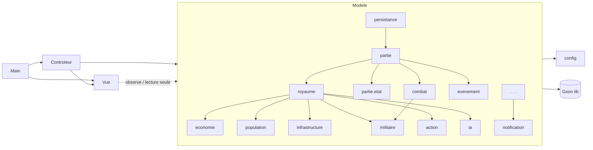

> Règle d'or MVC : **Vue → Modèle en lecture seule** (Observer), **Contrôleur**
> branche les écouteurs. Aucun package `Modele` n'importe Swing.

---

## 1. Cœur d'une partie (machine à états)

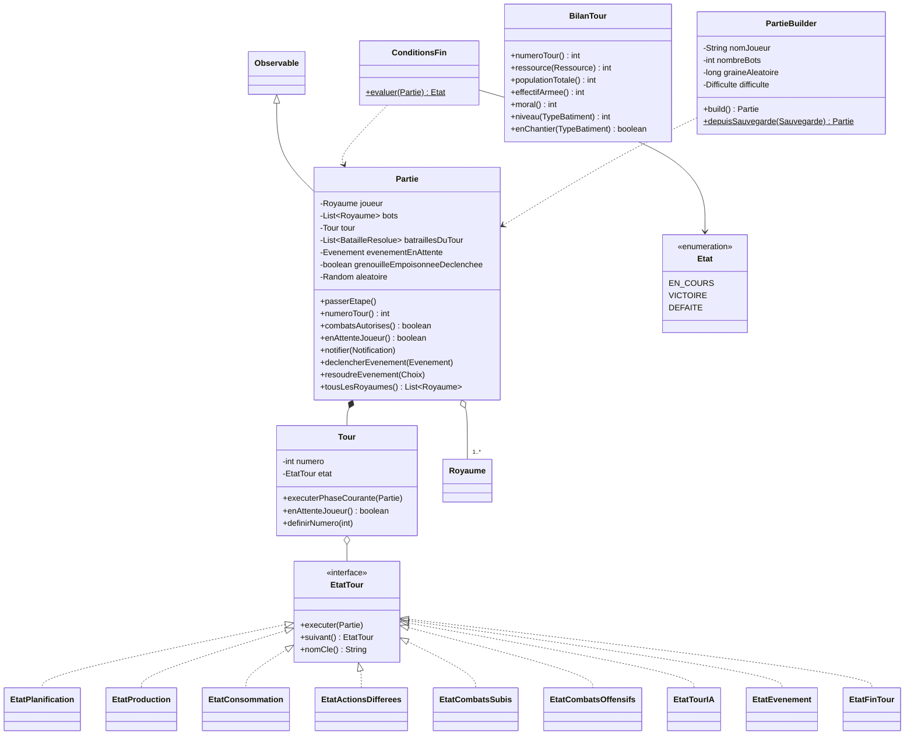

Enchaînement des états (chaîne `suivant()`) :
`Planification → Production → Consommation → ActionsDifferees → CombatsSubis →
CombatsOffensifs → TourIA → Evenement → FinTour → (Planification)`.

---

## 2. Royaume, économie et population

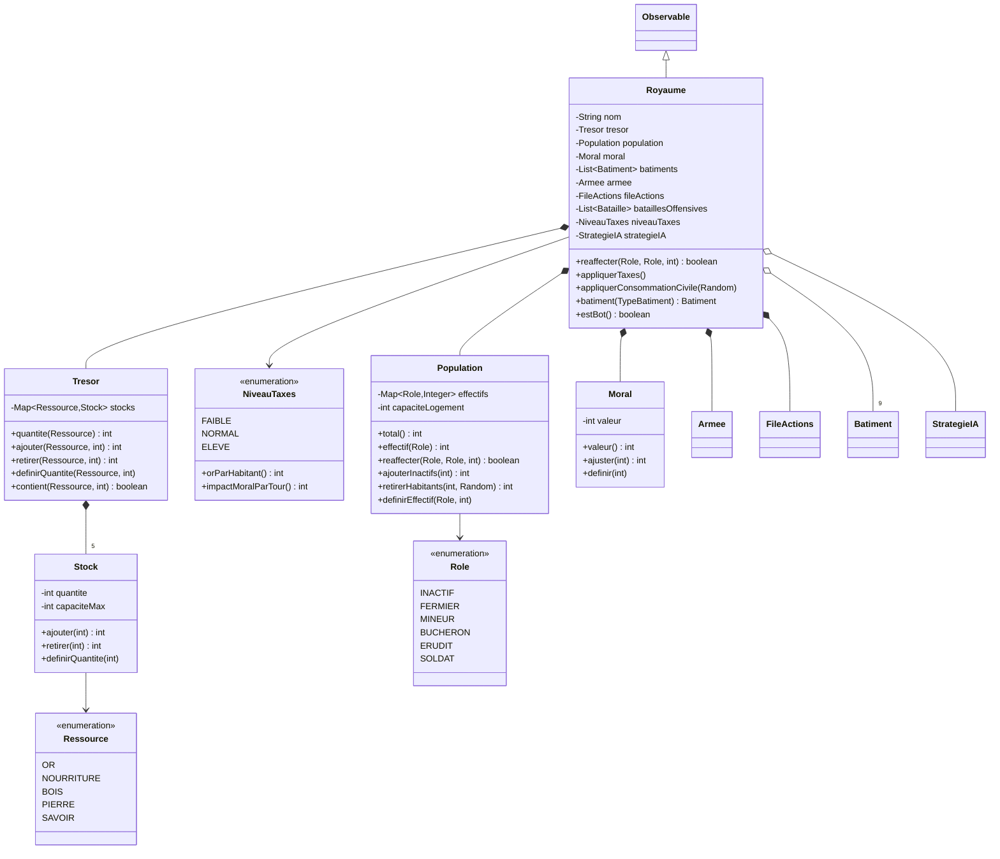

---

## 3. Infrastructure (les bâtiments)

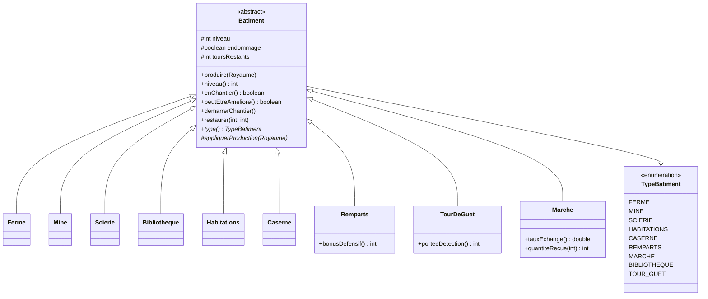

---

## 4. Militaire et moteur de combat

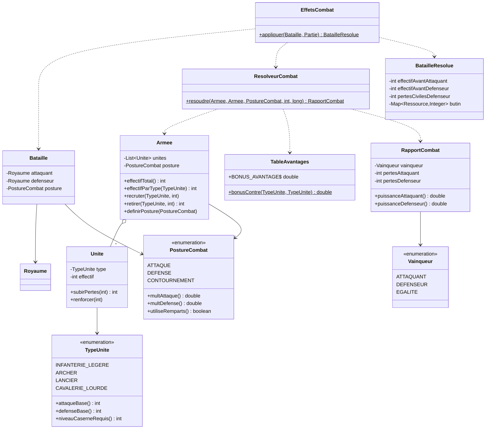

---

## 5. Actions (patron Commande)

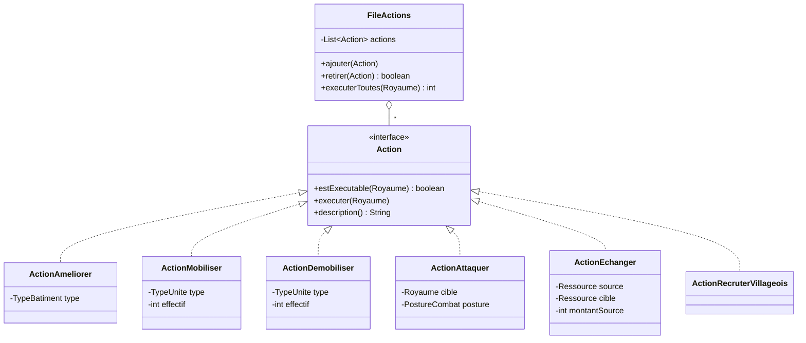

---

## 6. Intelligence artificielle (Strategy + Factory)

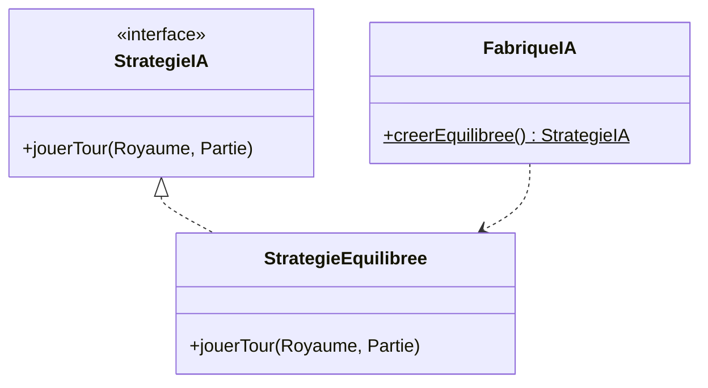

---

## 7. Événements

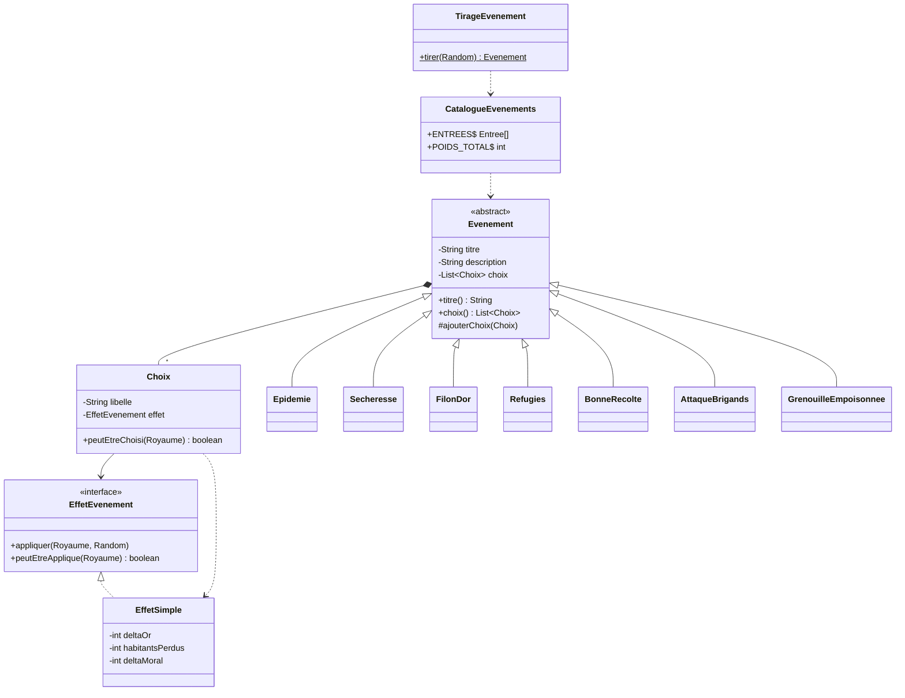

---

## 8. Notifications (patron Observateur)

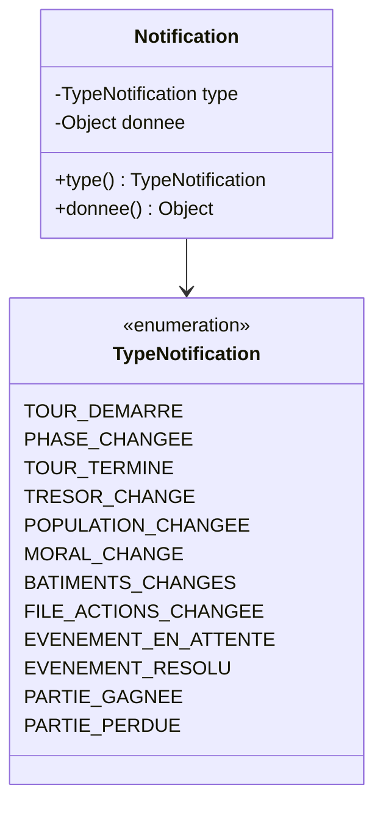

---

## 9. Persistance (sauvegarde JSON via Gson)

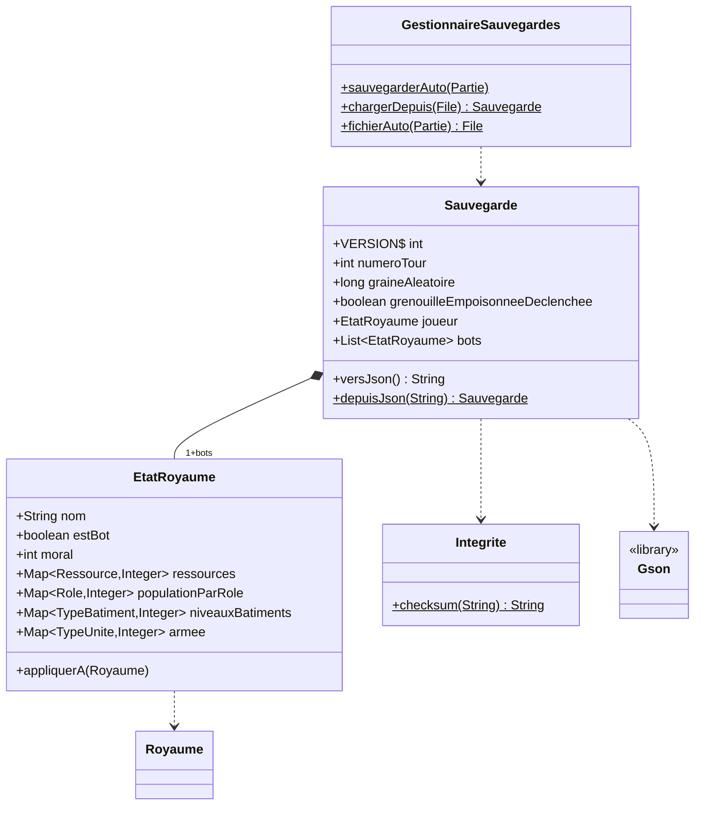

---

## 10. Configuration

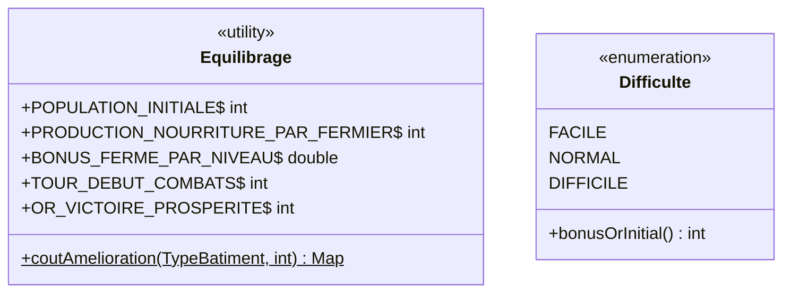

---

## 11. Couche Vue (Swing)

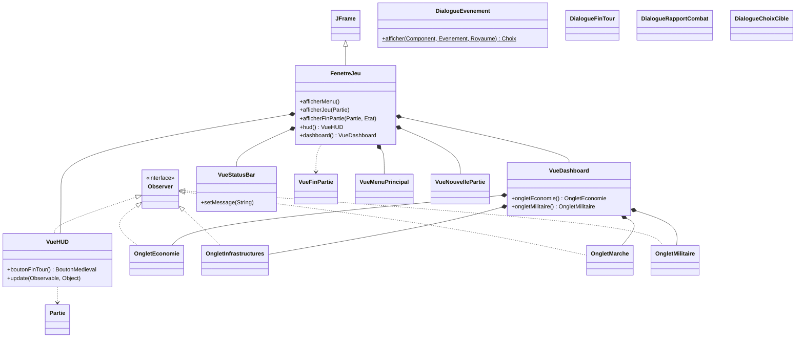

**Thème** (`Vue/theme/`) : `Palette` (couleurs), `Polices` (polices),
`BoutonMedieval` / `ToggleMedieval` (extends `JButton`/`JToggleButton`),
`PanneauOrne` (extends `JPanel`), `ChampsMedievaux` (helpers statiques de style).

---

## 12. Contrôleurs

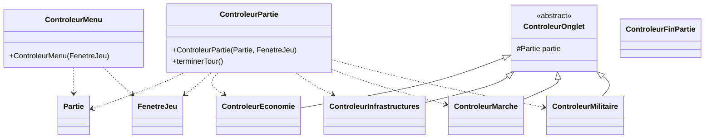

---

## Synthèse des patrons (où les retrouver dans l'UML)

| Patron | Classes |
|---|---|
| **State** | `EtatTour` + 9 `Etat*` (diag. 1) |
| **Observer** | `Observable`→`Partie`/`Royaume`, `Notification`, vues `Observer` (diag. 1, 2, 8, 11) |
| **Command** | `Action` + 6 actions, `FileActions` (diag. 5) |
| **Strategy** | `StrategieIA` → `StrategieEquilibree` (diag. 6) |
| **Factory** | `FabriqueIA` (diag. 6) |
| **Builder** | `PartieBuilder` (diag. 1) |
| **Template Method** | `Batiment.produire()` / `appliquerProduction()` (diag. 3) |
| **MVC** | packages `Modele` / `Vue` / `Controleur` (diag. 0) |
